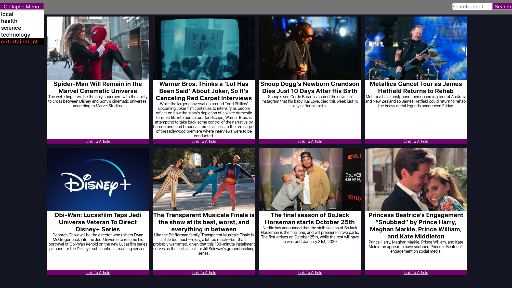

# What's New?

## Aplication 

This application was built with `create-react-app`. It displays news snippits, aggregating them from external websites and allowing the user to filter them based on category or searching for specific headlines. 

This was our first react project and I focused on creating clean code that was unit tested in jest.

### Screenshots

### Technologies Used

- React
- JavaScript
- CSS
- Jest
- React Testing Library
- fetch API

#### Future Work
- Commit to updating async functionality testing with Jest
- Fetch from multiple sites instead of a single endpoint.
- Implement extra error handling for replacing images.

